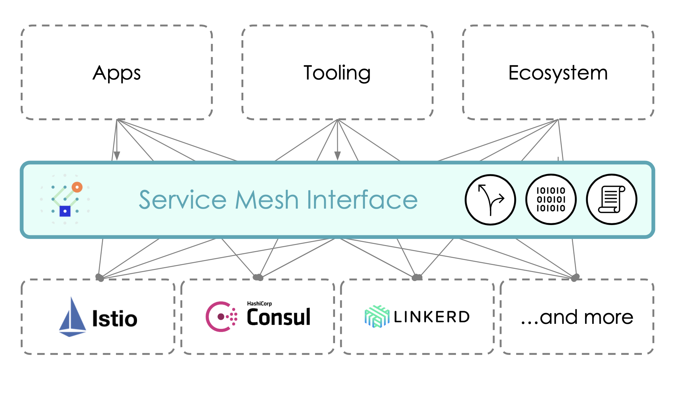

# CNCF SIG Sandbox Project Request - Service Mesh Interface (SMI)

## Acceptance to CNCF Sandbox

**Authors:** Lee Calcote ([@lcalcote](https://twitter.com/lcalcote))

## Background

- **Proposal TOC PR**: [#337  ](https://github.com/cncf/toc/issues/337) 
- **Proposal Presentation**: SIG Network meeting recording ([Jan 16, 2020](https://youtu.be/1eOrDXUrS-k))
- **Proposal Slides**: [Project deck](https://docs.google.com/presentation/d/11MssWPEyolaZwmJfg7sKE2BwSnGsmrXR3tdCscwf-WA/edit?usp=sharing)
- **Link to GitHub project**: [deislabs/smi-spec](https://github.com/deislabs/smi-spec)

## Project Overview

The Service Mesh Interface (SMI) is a specification for service meshes that run on Kubernetes. 
It defines a common standard that can be implemented by a variety of providers. This allows for both standardization for end-users and innovation by providers of Service Mesh Technology. It enables flexibility and interoperability.

This specification consists of multiple APIs:

- [Traffic Access Control](https://github.com/deislabs/smi-spec/blob/master/traffic-access-control.md) - configure access to specific pods and routes based on the identity of a client for locking down applications to only allowed users and services.
- [Traffic Specs](https://github.com/deislabs/smi-spec/blob/master/traffic-specs.md) - define how traffic looks on a per-protocol basis. These resources work in concert with access control and other types of policy to manage traffic at a protocol level.
- [Traffic Split](https://github.com/deislabs/smi-spec/blob/master/traffic-split.md) - incrementally direct percentages of traffic between various services to assist in building out canary rollouts.
- [Traffic Metrics](https://github.com/deislabs/smi-spec/blob/master/traffic-metrics.md) - expose common traffic metrics for use by tools such as dashboards and autoscalers.

See the individual documents for the details. Each document outlines:

- Specification
- Possible use cases
- Example implementations
- Tradeoffs

## Current Status

__Mar 1, 2020__

- Stars: 424
- Forks: 35
- Maintainers: 11 (Microsoft, Buoyant, Layer5, HashiCorp, KinVolk, Weaveworks)
- Releases: [2](https://github.com/deislabs/smi-sdk-go/releases)
- Commits: 109
- Contributors: 17
- Integrations:
  - [Consul](https://consul.io)
  - [Flagger](https://flagger.app)
  - [Istio](https://istio.io)
  - [Linkerd](https://linkerd.io)
  - [Maesh](https://mae.sh)
  - [Meshery](https://meshery.io)
  - [Prometheus](https://prometheus.io)
  - [Rio](https://rio.io)
  - [Service Mesh Hub](http://servicemeshhub.io)
  
- Adopters: 8 current public adopters
  - [Buoyant](https://buoyant.io)
  - [Containous](https://containo.us)
  - [HashiCorp](https://hashicorp.io)
  - [Layer5](https://layer5.io)
  - [Rancher](https://rancher.com)
  - [Solo](https://solo.io)
  - [Weave](https://www.weave.works)
)
- Presentation/Blog:
  - [SMI: Developer Friendly APIs for Service Mesh](https://www.youtube.com/watch?v=KXTBqzqQ_1o)
  - [CNCF SIG Network: SMI Project Overview](https://youtu.be/1eOrDXUrS-k?t=2243)
  - [Supercharge Your Microservices CI/CD with Service Mesh Interface and Kubernetes](https://www.youtube.com/watch?v=SMoaem3UBag)
  - [Democratizing Service Mesh on Kubernetes](https://youtu.be/gDLD8gyd7J8)
  - [A Standard Interface for Service Meshes](https://layer5.io/blog/a-standard-interface-for-service-meshes)

  
## Future Plans

- Progress all SMI APIs from current state (alpha) to beta/v1
- SMI SDK for Go (github.com/deislabs/smi-sdk-go) stable release
- Additional service mesh integrations
  - Kuma - kuma.io
- Additional ecosystem tooling integrations (like Flagger)
  - Meshery - meshery.io
  - Kiali - kiali.io
  - Tilt - tilt.dev
 - Conformance test suite (with Meshery)
  - Help users & integrators see what features are supported by a given mesh

# Project Scope

Kubernetes only. Lowest common denominator service mesh functionality.

## Project Goals

The goal of the SMI API is to provide a common, portable set of Service Mesh APIs which a Kubernetes user can use in a provider agnostic manner.

In this way people can define applications that use Service Mesh technology without tightly binding to any specific implementation.

## Project Non-Goals
It is a non-goal for the SMI project to implement a service mesh itself.

It merely attempts to define the common specification.

Likewise it is a non-goal to define the extent of what it means to be a Service Mesh, but rather a generally useful subset. 

If SMI providers want to add provider specific extensions and APIs beyond the SMI spec, they are welcome to do so. 

We expect that, over time, as more functionality becomes commonly accepted as part of what it means to be a Service Mesh, those definitions will migrate into the SMI specification.

## Alignment with CNCF mission
The Service Mesh Interface spec is well-aligned with the CNCF mission to make cloud native computing ubiquitous. Interoperability creates a virtuous cycle which increases adoption. SMI encourages an open source, vendor-neutral service mesh ecosystem by empowering end users to build upon ecosystem tools without needing to re-implement the underlying substrate.

## Value-add to the CNCF ecosystem

CNCF provides a vendor neutral home for service mesh interoperability.

Encourage user adoption of cloud native infrastructure without fear of lock-in.

Increase user adoption of cloud native infastructure through consistent interface.

## Alignment with other CNCF projects

SMI interoperates with these CNCF projects:

- Kubernetes
- gRPC
- Helm
- Linkerd
- Prometheus

## Anticipated use cases

- [Traffic Access Control](https://github.com/deislabs/smi-spec/blob/master/traffic-access-control.md) - 
- [Traffic Specs](https://github.com/deislabs/smi-spec/blob/master/traffic-specs.md) - 
- [Traffic Split](https://github.com/deislabs/smi-spec/blob/master/traffic-split.md) - 
- [Traffic Metrics](https://github.com/deislabs/smi-spec/blob/master/traffic-metrics.md) - 

## Alignment with SIG Reference Model

[SIG Network](https://github.com/cncf/sig-network)

## High level architecture

# Formal Requirements

SIG Sponsors: Lee Calcote
TOC Sponsors: Matt Klein, Jeff Brewer, Brendan Burns

# CNCF IP Policy  

*External dependencies (including licenses):*
While the spec itself does not have dependencies, the SMI Go SDK lists [these dependencies](https://github.com/deislabs/smi-sdk-go/blob/master/go.mod):

 * https://github.com/kubernetes/client-go[github.com/kubernetes-client/go] v0.0.0-20190516163813-075b33afc74f
 * https://github.com/stretchr/testify[github.com/stretchr/testify] v1.3.0
 * https://gopkg.in/yaml.v2[gopkg.in/yaml.v2] v2.2.2
 * https://github.com/kubernetes/api[k8s.io/api] v0.0.0-20181213150558-05914d821849
 * https://github.com/kubernetes/apimachinery[k8s.io/apimachinery] v0.0.0-20181127025237-2b1284ed4c93
 * https://github.com/kubernetes/client-go[k8s.io/client-go] v0.0.0-20181213151034-8d9ed539ba31
 * https://github.com/kubernetes/code-generator[k8s.io/code-generator] v0.0.0-20181114232248-ae218e241252

SMI Metrics lists https://github.com/deislabs/smi-metrics/blob/master/go.mod[these dependencies]:

 * https://github.com/deislabs/smi-sdk-go[github.com/deislabs/smi-sdk-go] v0.1.0
 * https://github.com/fsnotify/fsnotify[github.com/fsnotify/fsnotify] v1.4.7
 * https://github.com/go-chi/chi[github.com/go-chi/chi] * v4.0.2+incompatible
 * https://github.com/hellofresh/health-go[github.com/hellofresh/health-go] v2.0.2+incompatible
 * https://github.com/improbable-eng/go-httpwares[github.com/improbable-eng/go-httpwares] v0.0.0-20190118142334-33c6690a604c
 * https://github.com/Masterminds/sprig[github.com/masterminds/sprig] v2.18.0+incompatible
 * https://github.com/prometheus/client_golang[github.com/prometheus/client_golang] v0.9.3-0.20190127221311-3c4408c8b829
 * https://github.com/prometheus/common[github.com/prometheus/common] v0.3.0
 * https://github.com/sirupsen/logrus[github.com/sirupsen/logrus] v1.4.1
 * https://github.com/spf13/cobra[github.com/spf13/cobra] v0.0.3
 * https://github.com/spf13/pflag[github.com/spf13/pflag] v1.0.3
 * https://github.com/spf13/viper[github.com/spf13/viper] v1.3.2
 * https://github.com/stretchr/testify[github.com/stretchr/testify] v1.3.0
 * https://github.com/unrolled/render[github.com/unrolled/render] v1.0.0
 * https://gopkg.in/yaml.v2[gopkg.in/yaml.v2] v2.2.2
 * https://github.com/kubernetes/api[k8s.io/api] v0.0.0-20190409021203-6e4e0e4f393b
 * https://github.com/kubernetes/apimachinery[k8s.io/apimachinery] v0.0.0-20190404173353-6a84e37a896d
 * https://github.com/kubernetes/client-go[k8s.io/client-go] v11.0.0+incompatible
 * https://github.com/kubernetes/klog[k8s.io/klog] v0.3.2

 SMI adapter for Istio lists [these dependencies](https://github.com/deislabs/smi-adapter-istio/blob/master/Gopkg.toml):

* https://github.com/coreos/prometheus-operator[github.com/coreos/prometheus-operator]
 * https://github.com/deislabs/smi-sdk-go[github.com/deislabs/smi-sdk-go]
 * https://github.com/evanphx/json-patch[github.com/evanphx/json-patch]
 * https://github.com/go-openapi/spec[github.com/go-openapi/spec]
 * https://github.com/operator-framework/operator-sdk[github.com/operator-framework/operator-sdk]
 * https://github.com/kubernetes/api[k8s.io/api]
 * https://github.com/kubernetes/apiextensions-apiserver[k8s.io/apiextensions-apiserver]
 * https://github.com/kubernetes/apimachinery[k8s.io/apimachinery]
 * https://github.com/kubernetes/client-go[k8s.io/client-go]
 * https://github.com/kubernetes/code-generator[k8s.io/code-generator]
 * https://github.com/kubernetes/gengo[k8s.io/gengo]
 * https://github.com/kubernetes/kube-openapi[k8s.io/kube-openapi]
 * https://github.com/kubernetes-sigs/controller-runtime[sigs.k8s.io/controller-runtime]
 * https://github.com/kubernetes-sigs/controller-tools[sigs.k8s.io/controller-tools]

 *Initial committers (how long working on project, companies they represent):*

* https://github.com/deislabs/smi-spec/graphs/contributors
 * https://github.com/deislabs/smi-metrics/graphs/contributors
 * https://github.com/deislabs/smi-adapter-istio/graphs/contributors

 Contributors from Buoyant and Hashicorp shaped much of the initial spec development, along with contributors from Microsoft and others on all projects. 

# Other Considerations

## Cloud Native

**SMI** aligns closely with the Cloud Native Computing Foundation (CNCF) mission, and facilitates service mesh interoperability. Our hope is to align and help foster and grow an inclusive community with the CNCF.

## Project and Code Quality

- CI/CD: CircleCI
- Deployment: none currently
- Docs: https://github.com/deislabs/smi-spec (one in the same as the design docs)
- Project Site: https://smi-spec.io
- Design documents: Each of them here - https://github.com/deislabs/smi-spec
- Benefit from CNCF:
  - Vendor neutral home for service mesh abstraction between different projects and vendors.
  - Encouragement of open governance.

## Recommendation

**SIG Network's reflections and recommendation**
Beyond SMI's core value (not going to repeat here), has been demonstrated in projects like CNI, CSI, OpenTelemetry, and so on. SMI's repeatable patterns like that of a common init container stand to benefit the service mesh ecosystem broadly.

1. Consider: Moving SMI repositories to new GitHub org.
1. Consider: Relicensing to Apache v2 or seeking an exception.
1. Recommend: Moving forward into Sandbox.